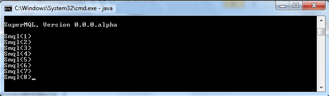

## What is SuperMQL
SuperMQL is an extension to existing ENOVIA/3DEXPERIENCE MQL . Using `SuperMQL` you can perform all operations which you can perform using native `MQL` client plus it adds some new features, like executing script as an alternative to TCL script. See Feature section for more details.

## Download latest version

[Latest version v2.0.0.beta](https://bit.ly/2xRRMEE)

<!---
https://github.com/fervort/SuperMQL/files/4405209/SuperMQL.v2.0.0.beta.zip
--->

## Shall I learn Groovy to use SuperMQL ?
No :) . Almost all java synatx are valid groovy syntax. So you can use java code in the script as it is. If you know Groovy then you can combine both the syntax. Check some sample scripts present in github at path [Here ](https://github.com/fervort/SuperMQL/tree/master/Scripts ) 

## Why should I use SuperMQL ?
  - You can use as an alternative to TCL . TCL is complex and old language but using SuperMQL, you can use java syntax to perform your ENOVIA tasks.
  - Once you write script, you don't need to compile it. Just change, save and execute.
  - You can execute native MQLs from SuperMQL (See How to use section)
  - You can create your own commands. It is called as MyQuery (See section My Query)
  - Database connection can be created using JDBC from script which is not easy from TCL.
  - Multithreading can be achieved in scripting. 
  - There are some SuperMQL commands by which you could perform tasks which are not possible to perform using native MQL. Like list all types where XYZ attribute is used. (Under Development)
  
## Features:
  - Support execution of java / groovy script on ENOVIA kernal (check .sms scripts in scripts folder)
  - You can create your own queries.(MyQuery)
  - Execute native MQLs
  - Execute java/groovy script in interactive mode
  - Use as RemoteMQL (See section `2. Deploy as standalone JAR` )
 
## How to deploy
### 1. Deploy inside Kernal
1. Download SuperMQL ZIP package from link provided above.
2. Extract the ZIP package.
3. Copy `SuperMQL.jar` and all JARs present in folder `SuperMQL_lib` in MQL Classpath. 

For 3dspace MQL classpath is :
```sh
# On Windows
3DSPACE_INSTALLED_DIRECTORY\win_b64\docs\javaserver
# On Linux
3DSPACE_INSTALLED_DIRECTORY/linux_b64/docs/javaserver
```
For studio classpath is   
```sh
# On Windows
STUDIO_INSTALLED_DIRECTORY\win_b64\docs\javaserver
# On Linux
STUDIO_INSTALLED_DIRECTORY/linux_b64/docs/javaserver
```

> Note : If you want to use SuperMQL using 3dspace MQL then copy JARs only in 3dspace classpath directory. Same for studio, if you want to use SuperMQL using studio MQL then copy JARs only in studio directory. Obviously, you could copy JARs in both the directory and use SuperMQL from 3dspace or studio. You could also copy this JARs in a common path and add this path as classpath in both 3dspace and studio directory.

4. Restart MQL if it is already running so that it will pickup the copied JARs.
5. As we can't modify ENOVIA kernal, we have to insert one supporting JPO to invoke the SuperMQL.jar file we copied in last step. This JPO ( `SuperMQL_mxJPO.java` ) is already provided in the ZIP package you have downloaded in last step.
6. Copy JPO SuperMQL_mxJPO.java to server where 3dspace or studio is running.
7. Insert and compile JPO using MQL command
```sh
insert program D:\Path\to\jpo\SuperMQL_mxJPO.java;

compile program SuperMQL force update;
```
8. That's All. 
### 2. Deploy as standalone JAR
If you can't deploy SuperMQL inside kernal, you can also used it as a standalone JAR . In this approach you have to provide ENOVIA login credentials to connect to the server. Follow these steps: 

1. Download SuperMQL ZIP package from link provided above.
2. Extract the ZIP package.
3. Copy `eMatrixServletRMI.jar` from ENOVIA classpath (It is present in directory `3DSPACE_INSTALLED_DIRECTORY\win_b64\docs\javaserver` and also in TomEE `WEB-INF/lib` folder) and paste into folder `SuperMQL_lib` .
4. Execute following command from path where `SuperMQL.jar` is located. (Replace command with your server URL and credentials)
```sh
java -jar SuperMQL.jar  -login "http://3dspace:8070/internal" "creator" "pass123" "eService Production"
```
5. Make sure that java is in the classpath . If it is not in the classpth, you can execute SuperMQL with complete java path. For example: 
```sh
C:\Program Files\Java\jdk1.8.0_171\bin\java.exe -jar SuperMQL.jar  -login "http://3dspace:8070/internal" "creator" "pass123" "eService Production"
```
6. That's All. 

> Note : You have to provide `No CAS` URL. `CAS` is not supported yet. 

## How to use SuperMQL
### Execute java/groovy script : 
- Start MQL and execute `SuperMQL` JPO like: 
```sh
execute program SuperMQL C:\Work\Scripts\ListVaults.groovy;
```
> `ListVaults.groovy` is provided in the ZIP package you have downloaded in last step. 
Also try `PrintBusTNR.sms`, This script demostrate how to use loops and mix groovy and java syntax.
`NOTE:` On windows environment, if you are getting errors while passing complete file path, try to escape the `backslash` (\\) For example: 
`execute program SuperMQL C:\\Work\\Scripts\\ListVaults.groovy;`

### Command line mode : 
- Start MQL and execute `SuperMQL` JPO like: 
```sh
execute program SuperMQL;
```
This command will start SuperMQL in command line mode. Like



- You can also execute java/groovy script in command line mode using flag `f` (file) like
```sh
Smql<1>f D:\Project\script\RenameBus.groovy
# on windows environment, you might need to escape backslash. For example: 
Smql<1>f D:\\Project\\script\\RenameBus.groovy
```
- You can also execute java/groovy script in command line mode using flag `f` (file) like
- Native MQL can be executed from SuperMQL prompt. Use dot `.` to start a command.
```sh
Smql<2>. temp query bus Part A-* * select id; 
``` 
- Java/Groovy script can be executed in interactive mode Using flag `i` (interactive)
```sh
Smql<3>i def result=mql('list type *'); print result ; 
``` 

## SuperMQL Configuration

[Read more about configuration in wiki page ](https://github.com/fervort/SuperMQL/wiki/Configuration)

## My Query
Using SuperMQL, you can create your own query (alias to native `MQLs` ). Check following wiki link for more. 

[Read more about MyQuery here ](https://github.com/fervort/SuperMQL/wiki/My-Query)

## Interactive Script 
Interactive Script is way of writing/executing MQLs using programming features like loops conditions and etc. 
In another word, it is possible to interacte with MQL using programming features like loops, conditions and sysout. 
You can quickly test something without writing TCL script or JPO.

[Read more about Interactive Scripts and some examples here ](https://github.com/fervort/SuperMQL/wiki/Interactive-Script)

## Total Hits


